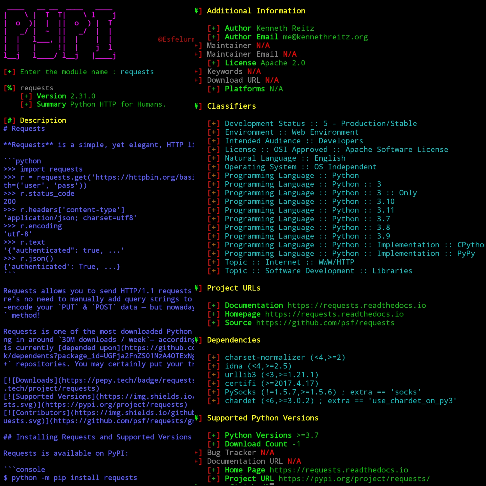

### Get module information 

#### You can get complete information about a Python module with this tool! 

## screen shot 


### Module used :
- requests
- time

* connected to Api PyPi

### Install :

```
git clone https://github.com/esfelurm/pypi-searcher
cd pypi-searcher
python pypi-searcher.py
```
